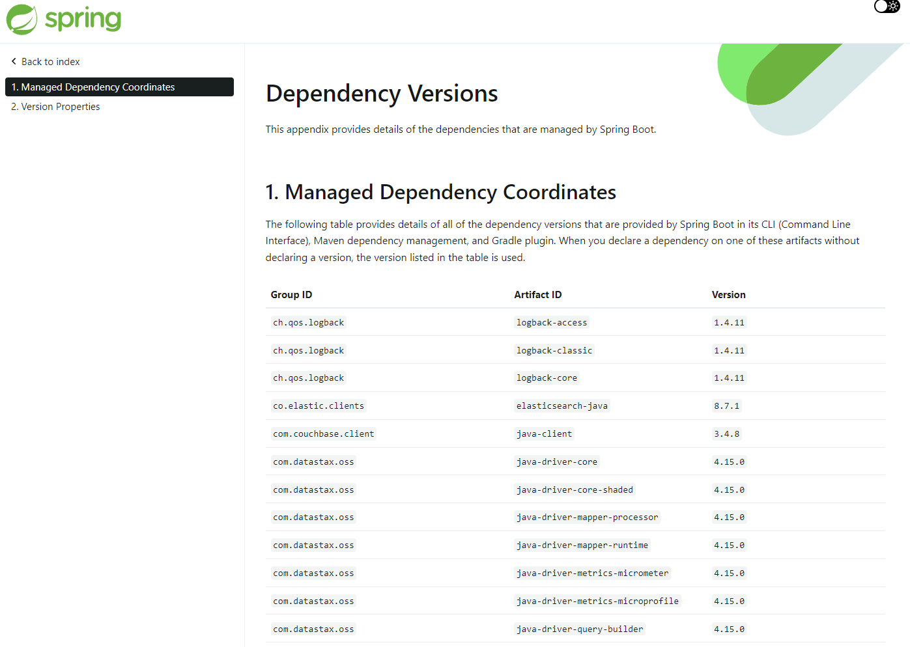

## 개요
이 글은 inflearn 강의 '[자바 ORM 표준 JPA 프로그래밍-기본편](https://www.inflearn.com/course/ORM-JPA-Basic/dashboard)'을 보면서 정리한 글입니다.    
1년 전에 본 적이 있으나 다시 복습하는 차원에서 보고 있습니다.  
다시 보려고 살펴보니 현재 실무에서 쓰고 있는 버전에 비해 낮기 때문에 공부하는 겸 버전을 올려서 복습해보기로 했습니다.  
자바 버전 - 17  
스프링부트 버전 - 3.1.3  
해당 버전으로 진행을 하면서 막히는 부분이나, 새롭게 알아낸 부분에 대해 띄엄띄엄 작성될 수 있습니다.  


## 적절한 springboot 의존성 버전 확인하기
1. [spring-boot 공식문서](https://spring.io/projects/spring-boot)로 이동
2. Learn 탭 선택
3. 내가 쓰고있는 버전의 Reference Doc. 선택
4. 하단의 Dependency Versions를 선택
5. 쓰고자 하는 의존성 검색하기

솔직히 mavenRepository에서 찍기하듯이 사람들이 많이 쓰는 의존성 추가해보고 되면 좋고 안되면 마는 식의 진행보다는 여기서 확인을 하는게 훨씬 좋아보인다.  




## hibernate-entitymanager deprecate
hibernate-entitymanager는 deprecate되었다.  
entitymanager 대신에 hibernate-core를 추가하도록 하자.  


jakarta.persistence 안에 jpa 구현체들이 들어있다.  
따라서 단순 인터페이스인 jpa가 작동하게 된다.  


## h2 버전 확인하기
h2를 온라인에서 다운받은 버전과 의존성에서 추가한 버전이 동일해야한다.  
만일 동일하지 않다면 의도치않게 작동될 수 있다.  

### h2 접속하기


- 특정 버전 이후부터 보안상의 이유로 test가 자동으로 생성되지 않는다.  
- h2는 jdbc:h2:./'이름' 으로 작성하고 연결하면 자동으로 '이름'으로 데이터베이스가 생성된다
- 단, 연결할때는 jdbc:h2:tcp://localhost/~/'이름'으로 접근해야한다.
- 이유는 두군데서 동시에 접근하면 오류가 일어나기 때문이다?
- persistence.xml에서도 똑같이 tcp를 사용해서 접근해야한다  

#### 주의해야 할 점
내가 의도한 데이터베이스와 제대로 연결이 제대로 안됐더라도 마치 아무 문제가 없는것처럼 작동될 때가 있다.  
h2 콘솔 우클릭의 create database로 생성한 데이터베이스가 그러한데, 어떤 때는 비밀번호를 입력하지 않았는데 접근이 되고, 입력하면 접근에 실패하기도 한다.  
조심해서 다루도록 하자.  


 
## persistence.xml은 필요한가?
jpa 설정 파일로 resources/META-INF/persistence.xml 파일을 생성했다.  
하지만 내부 properties를 보면 어디선가 많이 봐온 설정들이었다.  


h2 드라이버를 연결하기 위해서 properties 파일에 적었던 내용과 거의 유사했다.  
~~따라서 대체가 가능하다면 굳이 익숙하지 않은 xml을 생성하는 것보다는 properties를 쓰기로 했다. -~~

결론부터 말하면 Persistence.createEntityManagerFactory("") 메소드를 쓰기 위해서는 persistence.xml을 써야한다!  
persistenceunitname을 괄호 안에 설정해줘야한다. 하지만 application.properties를 쓰면 해당 값을 설정해줄 수가 없다.  

뭐... spring을 쓰면 위의 코드는 사실상 전부 대체가 되기 때문에 굳이 Persistence를 명시하면서 쓰지 않아도 되기는 하다.  


## Dialect란?
위의 사진에서 org.hibernate.dialect.H2Dialect를 볼 수 있다. 그렇다면 이 설정은 어떤 것일까?
jpa는 데이터베이스에 종속적이지 않다. 그말인즉, save를 한다고 하면 mssql, mysql, oracle 등에서도 모두 동일하게 작동한다.  
이것을 가능하게 하는 것이 jpa가 자동으로 해당 언어에 맞게 바꿔주기 때문이다.    
dialect를 H2Dialect로 바꿔줌으로서 jpa에 쓰이는 명령어들이 H2데이터베이스에 맞게 수정해주는 역할을 하게 된다.  


## JPA 구동 방식


1. Persistence에서 시작한다.  
2. 설정 정보를 읽는다(사진에는 persistence.xml, 내가 작성한 것은 application.properties)
3. EntitymanagerFactory를 생성한다(1개만)

> EntityManagerFactory가 생성될때 db와 연결이 된다
{: .prompt-info}

이제 필요할 때마다 EntityManager를 생성해서 사용하게 된다.  


## EntityManagerFactory, EntityManager의 관계
- EntityManagerFactory는 하나만 만들어서 애플리케이션 전체에서 공유한다
- EntityManager는 필요할 때마다 하나씩 생성해서 사용한다
- EntittyManger는 쓰레드 간에 공유를 해서는 안된다. (어떻게 보면 당연한 말이기도 하다)
- JPA의 모든 데이터 변경은 트랜잭션 안에서 실행해야 한다

> 공장은 하나, 제품은 여러개!


## JPA? JPQL?

`JPA`는 자바에서 데이터베이스 작업을 하기 위해 제공되는 API이다.   
`JPQL`(Java Persistence Query Language)은 JPA에서 좀더 복잡한 기능(복잡한 검색, 대량 삭제, 업데이트, 조인, 집계, 프로젝션, 서브쿼리 등)을 위해 나타난 라이브러리이다.  

#### JPQL 에 대한 간단한 설명
```java
List<Member> result = em.createQuery("select m from Member as m", Member.class)
        .getResultList();
```
createQuery 안에 들어가는 Member는 테이블의 이름을 뜻하는 것이 아니다!  
여기서 Member는 내가 선언한 @Entity 테이블명을 의미한다.  


- JPQL은 엔티티 객체를 대상으로 쿼리가 작성된다
- (SQL은 데이터베이스 테이블을 대상으로 쿼리가 작성된다)
- JPQL을 사용하면 Dialect 덕분에 어느 데이터베이스를 사용하던지 상관없이 알아서 쿼리를 짜준다.  
- JPQL은 `객체 지향 쿼리 언어`를 제공한다. 본인만의 고유한 언어를 가지고 있다.  

> 엔티티 객체 ~~ DTO 유사하게 쓰


## 짤막한 지식
- javax는 스프링부트 3.0으로 올라오면서 jakarta로 변경된다.


## 참고 사이트
1. [김영한님의 JPA 강의](https://www.inflearn.com/course/lecture?courseSlug=ORM-JPA-Basic&unitId=21685&category=questionDetail)
기초를 다진다는 느낌으로 다시 복습하는 마음으로 공부하고 있다.  

